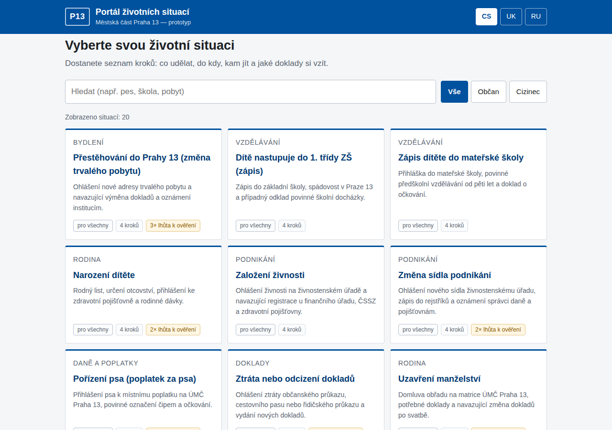
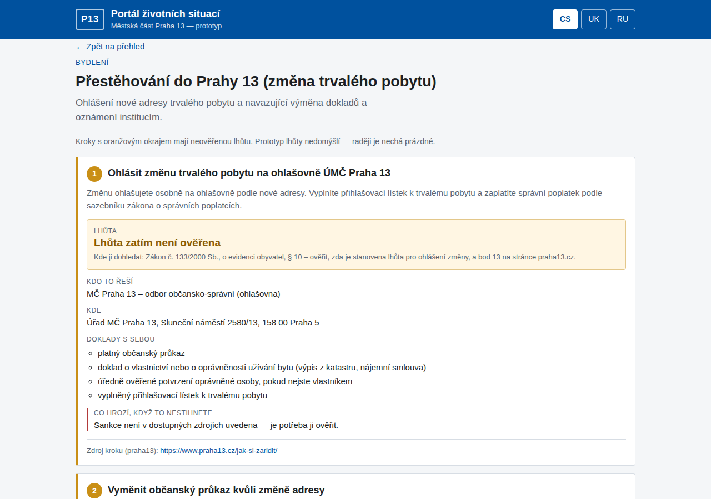

# Portál životních situací — MČ Praha 13

Prototyp pro ideathon *Idea 13*. Uživatel si vybere svoji životní situaci a dostane
osobní checklist: **co udělat, DO KDY, kam jít, jaké doklady s sebou a co hrozí,
když to nestihne** — u každého kroku s odkazem na zdroj.

Součástí je parser dvou zdrojů (Katalog služeb veřejné správy + stránky „Jak si
zařídit“ MČ Praha 13), lokální databáze 20 situací a jednoduchý web. Datová
struktura je připravená tak, aby se stejná databáze dala použít jako podklad pro
chatbota Prahabot 13 (RAG). Samotný bot ani LLM součástí prototypu nejsou.



---

## 1. Spuštění (Windows / PowerShell)

Potřeba je pouze **Python 3.8+**. Žádné `pip install`, žádný Node, žádný databázový
server — vše je ve standardní knihovně Pythonu.

```powershell
cd C:\cesta\k\projektu\idea13-
py app.py
```

Server sám vytvoří databázi, naplní ji 20 situacemi a otevře prohlížeč na
<http://127.0.0.1:8013/>. **Funguje bez internetu** — data jsou v lokálním souboru
`data/portal.sqlite3`.

Další volby:

```powershell
py app.py --port 8080      # jiný port
py app.py --no-open        # neotevírat prohlížeč (hodí se při demu na projektoru)
```

Kontrola, že data splňují pravidla zadání (počty, zdroje, žádné vymyšlené lhůty):

```powershell
py check.py
```

Když je potřeba databázi postavit znovu od nuly:

```powershell
Remove-Item data\portal.sqlite3
py seed.py
```

## 2. Parser (samostatný příkaz)

```powershell
py -m parsers.run all              # Katalog služeb + praha13.cz + provázání
py -m parsers.run katalog          # jen Katalog služeb veřejné správy
py -m parsers.run praha13 --limit 30
py -m parsers.run link             # přiřadí staženým stránkám konkrétní situace
py -m parsers.run lookup "zivnost" # vyhledání služby v katalogu podle názvu
py -m parsers.run report           # seznam neověřených lhůt k ruční práci
py -m parsers.run status           # co je v databázi + poslední běhy
py -m parsers.run selftest         # offline test parseru šablony (bez sítě)
py -m parsers.run shape            # vypíše skutečnou strukturu dumpu katalogu
```

Užitečné přepínače: `--force` (ignoruje cache), `--limit N`, `--max-age SEKUNDY`,
`--jsonld` (místo `sluzby.json` se použije `sluzby.jsonld`).

Vlastnosti parseru:

* **Cache na disk** — vše stažené leží v `data/cache/` (tělo + `.meta.json` s ETag).
  Opakovaný běh nestahuje znovu, dokud je cache mladší než týden.
* **Idempotence** — `INSERT OR REPLACE`, opakovaný běh nic nezduplikuje.
* **Odolnost** — jedna rozbitá stránka nebo jeden vadný záznam běh neshodí;
  chyba se zaloguje a pokračuje se dál.
* **Offline** — když je síť nedostupná, použije se starší cache a do logu jde varování.
* **Log** — obrazovka + `logs/parser.log` + tabulka `parse_log` (dotaz přes `status`).

### Zdroj A — Katalog služeb veřejné správy (open data, CC BY 4.0)

`https://rpp-opendata.egon.gov.cz/odrpp/datovasada/sluzby.json` (případně `.jsonld`,
schéma OFN „registr práv a povinností / služby“).
Ukládá se `id`, `kód`, `název`, `popis`, `agenda`, `právní předpis`, `kanál služby`
a `ohlašovatel` do tabulky `katalog_services`.

Názvy klíčů se mezi verzemi OFN mění, proto se nic nehledá natvrdo: každé pole se
hledá přes seznam kandidátských názvů porovnávaných bez diakritiky a podtržítek
(`parsers/katalog.py`, konstanty `F_NAME`, `F_AGENDA`, …). Když se něco nenajde,
zůstane pole prázdné a zaloguje se to. Skutečnou strukturu dumpu vypíše
`py -m parsers.run shape` — podle ní stačí doplnit kandidáta do seznamu.

### Zdroj B — „Jak si zařídit“ MČ Praha 13 (jen HTML)

Strojově čitelná verze neexistuje, takže se scrapuje. Odkazy se sbírají z
`https://www.praha13.cz/jak-si-zaridit/` i ze `sitemap.xml`. Stránky mají
standardní českou šablonu životní situace číslovanou po bodech, parsuje se tedy
podle čísla bodu (bod 8 útvar, bod 9 adresa a úřední hodiny, bod 10 doklady,
bod 11 formuláře, bod 12 poplatky, bod 13 lhůty, bod 20 sankce, bod 25 odpovědný
útvar). Když číslování na stránce chybí, zkusí se ještě nadpisy podle klíčových slov.

## 3. Nejdůležitější pravidlo: lhůty se nevymýšlejí

Katalog služeb **nemá strukturované pole pro lhůtu ani pro sankci** — existují jen
jako volný text nebo přímo v zákoně. Prototyp proto nikdy žádnou lhůtu, pokutu ani
částku nedomýšlí:

| `deadline_status` | Význam | Co je v UI vidět |
|---|---|---|
| `verified` | Lhůta má přesný zdroj (§ zákona nebo URL) | Lhůta velkým písmem + zdroj |
| `manual_todo` | Lhůta nebyla ověřena | **„Lhůta zatím není ověřena“** + oranžové zvýraznění + odkaz, kde ji dohledat |
| `not_applicable` | V tomto kroku žádná lhůta není | „Lhůta se v tomto kroku neuplatní“ |

Aktuální stav dat: **24 ověřených lhůt, 37 kroků čeká na ověření, 22 kroků lhůtu nemá.**
Prázdná pole jsou vlastnost prototypu, ne chyba — ukazují přesně ta místa, kde
informace ve zdrojích chybí.

Kontrolu vynucuje seeder: pokud by někdo u kroku s `manual_todo` vyplnil lhůtu
nebo u `verified` zapomněl zdroj, `py seed.py` skončí chybou a data se nenahrají.

Text z bodu 13 stažených stránek se ukládá do `praha13_pages.deadline_text_raw`,
zobrazuje se jen jako **neověřený** podklad a do kroků se nikdy nepřepisuje automaticky.

## 4. Kde žijí ručně zadané lhůty

Všechny ručně zadané texty, lhůty i zdroje jsou v jediném souboru:

```
data/manual/situations.json
```

Postup při ověření lhůty:

1. `py -m parsers.run report` vypíše kroky s `manual_todo`, u každého hint,
   kde lhůtu hledat, a případně text bodu 13 ze stažené stránky.
2. V `data/manual/situations.json` se u kroku vyplní `deadline_text`
   (a volitelně `deadline_days`), `deadline_source` (přesný § nebo URL) a
   `deadline_status` se změní na `verified`; `verify_hint` se smaže.
3. `py seed.py` — data se znovu nahrají a zkontrolují.

## 5. Struktura projektu

```
idea13-/
├─ app.py                     # webový server + JSON API (stdlib http.server)
├─ db.py                      # SQLite schéma a pomocné funkce
├─ seed.py                    # naplnění 20 situací + kontrola pravidel
├─ parsers/
│  ├─ http_cache.py           # stahování s diskovou cache, offline fallback
│  ├─ katalog.py              # zdroj A: Katalog služeb veřejné správy
│  ├─ praha13.py              # zdroj B: scraper 25bodové šablony
│  └─ run.py                  # CLI parseru (all/katalog/praha13/link/lookup/report/…)
├─ data/
│  ├─ manual/situations.json  # ZDROJ PRAVDY: 20 situací, kroky, ověřené lhůty
│  ├─ fixtures/               # vzorová stránka pro offline selftest
│  ├─ cache/                  # stažené soubory (mimo git)
│  └─ portal.sqlite3          # generovaná databáze (mimo git)
├─ web/
│  ├─ index.html, styles.css, app.js, favicon.svg
├─ logs/parser.log            # log běhů parseru (mimo git)
└─ docs/                      # screenshoty do README
```

## 6. Datový model

Jeden záznam = **jeden krok** uvnitř situace (`db.py`).

**situations** — `id`, `slug`, `title_cs/uk/ru`, `summary_cs/uk/ru`, `category`,
`audience` (`all` | `citizen` | `foreigner`), `praha13_url`, `katalog_keywords`, `sort_order`

**steps** — `id`, `situation_id`, `step_order`, `title_cs/uk/ru`, `body_cs/uk/ru`,
`deadline_text`, `deadline_days`, `deadline_source`, `deadline_status`,
`sanction_text`, `sanction_source`, `authority`, `location`, `office_hours`,
`documents` (JSON pole), `source_type` (`katalog_sluzeb` | `praha13` | `sbirka_zakonu` | `manual`),
`source_url`, `verify_hint`

Tabulky plněné parserem: **katalog_services**, **praha13_pages**, **parse_log**.

Pole `verify_hint` je navíc oproti zadání: u kroků s `manual_todo` drží odkaz na
to, kde se má lhůta dohledat. Bez něj by prázdné pole nikomu nepomohlo.

### JSON API

| Endpoint | Co vrací |
|---|---|
| `GET /api/situations?q=&audience=` | seznam situací (hledání bez ohledu na diakritiku) |
| `GET /api/situations/<slug>` | situace + kroky + související služby z katalogu + stažená stránka |
| `GET /api/katalog?q=` | vyhledání služby v Katalogu služeb |
| `GET /api/stats` | počty záznamů, poslední běh parseru |

Tohle API je zároveň to, co by později konzumoval chatbot.

## 7. Frontend



* Obrazovka 1: dlaždice situací, fulltext (funguje i bez diakritiky — „zivnost“
  najde „živnost“) a filtr *Vše / Občan / Cizinec*.
* Obrazovka 2: checklist kroků. Každý krok = karta: co udělat | **LHŮTA velkým
  písmem** | kdo to řeší | kde | doklady | co hrozí | zdroj drobně dole.
* Přepínač jazyků CS / UK / RU v hlavičce. Chybí-li překlad, zobrazí se čeština
  a nahoře se objeví upozornění „Některé texty jsou zatím jen v češtině“.
* Kroky s neověřenou lhůtou mají oranžový okraj, oranžové číslo a text
  „Lhůta zatím není ověřena“.
* Responzivní, ověřeno na šířce 360 px bez vodorovného posuvníku.
* Žádné localStorage, žádné přihlašování, žádné animace ani gradienty.

## 8. Co není hotové / co je potřeba doladit

1. **Parser nebyl spuštěn proti živým zdrojům.** V prostředí, kde prototyp vznikal,
   byl výstup na `rpp-opendata.egon.gov.cz` i `www.praha13.cz` zablokovaný egress
   politikou (HTTP 403 z proxy). Logika parseru je ověřená na vzorové stránce
   (`py -m parsers.run selftest`) a na podvrženém dumpu, ale **skutečné názvy klíčů
   v `sluzby.json` a reálné rozložení bodů na praha13.cz je potřeba při prvním
   běhu zkontrolovat** — na to slouží `py -m parsers.run shape` a `--limit`.
2. **37 lhůt čeká na ruční ověření** (viz `py -m parsers.run report`). Záměrně
   nejsou vyplněné.
3. **Sankce** jsou vyplněné jen tam, kde je lze doložit § zákona, a **bez částek**.
   Konkrétní výše pokut se musí dohledat v platném znění předpisů.
4. **Úřední hodiny a přesné adresy** u kroků jsou prázdné — mají se doplnit
   parserem z bodu 9 stránek praha13.cz, ne ručně.
5. **Hluboké odkazy na praha13.cz** jsou zatím na rozcestník `/jak-si-zaridit/`;
   konkrétní URL doplní `py -m parsers.run link` po prvním úspěšném scrapování.
6. Překlady UK/RU jsou jen u situací 1–4 a 15–20 (podle zadání). Ostatní situace
   se v UK/RU zobrazí česky.
7. Propojení na Katalog služeb je přes klíčová slova (`katalog_keywords`),
   ne přes identifikátor služby — na přesné párování je potřeba stažený katalog.
8. SPARQL endpoint katalogu se nepoužívá, stahuje se celý JSON dump.

## 9. Proč tenhle stack

* **Python 3 + standardní knihovna** (`sqlite3`, `urllib`, `html.parser`,
  `http.server`) — na Windows stačí `py app.py`, žádné `pip install`, tedy nic,
  co by se dalo v 6 ráno před demem rozbít. Autor umí Python, takže se dá cokoli
  opravit ručně přímo na místě.
* **SQLite jako jeden soubor** — žádný databázový server, databáze se dá smazat
  a za vteřinu vygenerovat znovu; zároveň umožňuje normální SQL dotazy pro budoucí RAG.
* **Vanilla HTML/CSS/JS bez frameworku** — žádný build, žádný `node_modules`,
  stránka se načte i z notebooku bez internetu.
* **Oddělený parser a seeder** — data se dají obnovit nezávisle na běhu webu.

---

## Quick start (EN)

Requirements: Python 3.8+ only (standard library, no dependencies).

```powershell
py app.py                 # creates + seeds the SQLite DB, serves http://127.0.0.1:8013/
py -m parsers.run all     # refresh data from both sources (cached to data/cache/)
py -m parsers.run report  # list of steps whose deadline is still unverified
py seed.py                # re-import data/manual/situations.json (validates the rules)
```

Deadlines are never invented: a step either has `deadline_status = verified` with an
exact source (§ of the law or a URL), or `manual_todo` with empty deadline fields and
a hint where to look. The UI shows unverified ones as *„Lhůta zatím není ověřena“*.

**Data sources / licence:** Katalog služeb veřejné správy (open data, CC BY 4.0),
veřejné stránky MČ Praha 13, Sbírka zákonů. Prototyp není závazné právní stanovisko.
